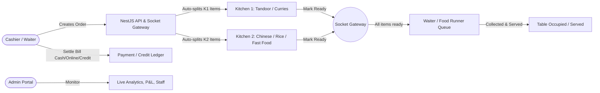

# 🍽️ RestaurantOS — Comprehensive Technical & Architecture Documentation

## 1. System Overview
**RestaurantOS** is a full-stack, enterprise-grade Restaurant Management & Point-of-Sale (POS) system designed for multi-station kitchen coordination, dine-in/delivery order handling, customer credit tracking, employee payroll, and real-time operational analytics.

---

## 2. Technology Stack

### Frontend Architecture
- **Framework**: Next.js 16.3 (Turbopack, App Router, React 19)
- **Styling**: TailwindCSS 4, Custom Glassmorphism Design System, Lucide Icons
- **State & Data Fetching**: `@tanstack/react-query`, Axios with JWT interceptors
- **Real-Time Communication**: `socket.io-client` with role-based room subscriptions
- **Visualization**: `recharts` for sales, revenue, and order velocity charts
- **Notifications**: `react-hot-toast`

### Backend Architecture
- **Framework**: NestJS 11 (Modular Architecture with Dependency Injection)
- **Database & ORM**: PostgreSQL + Prisma ORM 7 (`@prisma/adapter-pg`)
- **Authentication**: Passport-JWT, Refresh Tokens, Bcrypt Password Hashing
- **Real-Time Gateway**: `@nestjs/websockets`, `@nestjs/platform-socket.io` (Socket.IO Gateway)
- **Validation**: `class-validator`, `class-transformer` with strict Global Validation Pipe

---

## 3. Database Schema & Data Models (PostgreSQL / Prisma)

```
┌──────────────┐       ┌──────────────┐       ┌──────────────┐
│     User     │       │    Table     │       │   Customer   │
│  (Auth/Role) │       │ (Dine-in 1-20)│       │ (Credit/CRM) │
└──────┬───────┘       └──────┬───────┘       └──────┬───────┘
       │                      │                      │
       └──────────────┐       │       ┌──────────────┘
                      ▼       ▼       ▼
                    ┌──────────────────┐
                    │      Order       │
                    │(NEW/PREP/READY..)│
                    └─────────┬────────┘
                              │
         ┌────────────────────┼────────────────────┐
         ▼                    ▼                    ▼
┌──────────────────┐ ┌──────────────────┐ ┌──────────────────┐
│    OrderItem     │ │   KitchenOrder   │ │     Payment      │
│ (KITCHEN_1 / 2)  │ │ (K1 / K2 status) │ │(CASH/ONLINE/CRD) │
└──────────────────┘ └──────────────────┘ └──────────────────┘
```

### Core Entities

| Model | Purpose | Key Attributes |
|---|---|---|
| **User** | System users & staff authentication | `id`, `username`, `passwordHash`, `displayName`, `role`, `refreshToken` |
| **Category** | Menu groupings | `id`, `name`, `sortOrder`, `isActive` |
| **MenuItem** | Food & beverage catalog | `id`, `name`, `price`, `kitchen` (KITCHEN_1 / KITCHEN_2), `categoryId`, `isAvailable` |
| **Table** | Physical dine-in tables | `id`, `number` (1–20), `capacity`, `status` (AVAILABLE, OCCUPIED, RESERVED) |
| **Customer** | Customer directory & credit | `id`, `name`, `mobile`, `address`, `creditBalance` |
| **Order** | Dine-in & Delivery tickets | `id`, `orderNumber` (Auto-inc), `type` (DINE_IN/DELIVERY), `status`, `subtotal`, `total` |
| **OrderItem** | Specific dish items per order | `id`, `orderId`, `menuItemId`, `quantity`, `unitPrice`, `kitchen`, `kitchenStatus` |
| **KitchenOrder** | Station-specific aggregate state | `id`, `orderId`, `kitchen` (KITCHEN_1/KITCHEN_2), `status` (NEW/PREPARING/READY) |
| **Payment** | Invoicing & transactions | `id`, `orderId`, `amount`, `method` (CASH/ONLINE/CREDIT), `status` |
| **CreditLedger** | Khata / Customer credit history | `id`, `customerId`, `orderId`, `type` (DEBIT/CREDIT), `amount`, `balanceAfter` |
| **DeliveryInfo** | Delivery orders metadata | `id`, `orderId`, `customerId`, `address`, `deliveryBoy`, `phone`, `status` |
| **Expense** | Operational expenses | `id`, `categoryId`, `amount`, `date`, `paymentMethod`, `createdBy` |
| **Staff & Salary** | Employee registry & payroll | `name`, `role`, `salary`, `status` + `SalaryPayment` monthly records |
| **AuditLog** | Security & activity audit | `userId`, `action`, `entity`, `entityId`, `details`, `ipAddress` |

---

## 4. Multi-Role System & Station Workflows



### Role Breakdown

#### 1. Administrator (`ADMIN`)
- **Dashboard**: Live revenue, order velocity, active kitchen queues, quick statistics.
- **Menu Management**: Create/update items, assign to Kitchen 1 (Tandoor/Curries) or Kitchen 2 (Chinese/Rice/Fast Food), toggle availability.
- **Table Management**: Real-time table status grid (Available, Occupied, Reserved).
- **Customer & Credit**: Ledger tracking (debit/credit adjustments), payment settlements.
- **Financials**: Daily/monthly revenue reports, expense categories & tracking, staff salary disbursement.
- **System Settings & Auditing**: User creation, audit log inspection.

#### 2. Cashier (`CASHIER`)
- **POS / New Order**: Interactive menu grid, live cart, table selection, customer auto-complete.
- **Order Management**: Filter by status, view split items, print receipts.
- **Billing & Settlements**: Split payments, cash/UPI/credit settlement with instant receipt generation.
- **Credit (Khata)**: Customer balance search, outstanding dues, quick collection.

#### 3. Kitchen 1 (`KITCHEN1` - Tandoor & Indian Gravies)
- **KDS (Kitchen Display System)**: Real-time ticket cards via WebSocket.
- **Item Progression**: `NEW` ➔ `PREPARING` ➔ `READY`.
- **Sound Alerts**: Audio chime on new incoming orders.

#### 4. Kitchen 2 (`KITCHEN2` - Chinese, Rice, Fast Food)
- **Dedicated KDS**: Receives only items routed to Kitchen 2.
- **Independent Progression**: Tracks status independently from Kitchen 1.

#### 5. Waiter (`WAITER`)
- **Order Ready Queue**: Real-time notification when all items for a table are marked `READY` across both kitchens.
- **Delivery Confirmation**: Marks order as `COLLECTED` / `SERVED`.

---

## 5. Backend Modules & API Surface

All API routes are prefixed with `/api`:

| Module | Route Prefix | Main Endpoints |
|---|---|---|
| **Auth** | `/api/auth` | `POST /login`, `POST /refresh`, `POST /logout` |
| **Users** | `/api/users` | `GET /`, `POST /`, `GET /:id`, `PATCH /:id`, `DELETE /:id` |
| **Menu** | `/api/menu` | `GET /categories`, `POST /categories`, `GET /items`, `POST /items`, `PUT /items/:id` |
| **Tables** | `/api/tables` | `GET /`, `POST /`, `PUT /:id/status`, `DELETE /:id` |
| **Customers**| `/api/customers` | `GET /`, `POST /`, `GET /:id`, `PUT /:id`, `DELETE /:id` |
| **Orders** | `/api/orders` | `GET /`, `POST /`, `GET /ready`, `GET /kitchen/:kitchen`, `PUT /:id/status`, `PUT /:orderId/kitchen/:kitchen/status` |
| **Payments** | `/api/payments` | `GET /`, `POST /`, `GET /summary/today`, `GET /order/:orderId` |
| **Credit** | `/api/credit` | `GET /outstanding`, `GET /ledger`, `GET /customer/:customerId`, `POST /customer/:customerId/payment` |
| **Expenses** | `/api/expenses` | `GET /`, `POST /`, `GET /categories`, `POST /categories`, `GET /summary` |
| **Staff** | `/api/staff` | `GET /`, `POST /`, `PUT /:id`, `POST /:id/salary`, `GET /salary/history` |
| **Reports** | `/api/reports` | `GET /dashboard`, `GET /sales/daily`, `GET /sales/analytics`, `GET /expenses` |
| **Gateway** | WebSocket | Rooms: `ADMIN`, `CASHIER`, `KITCHEN1`, `KITCHEN2`, `WAITER` |

---

## 6. Seed Accounts & Credentials

When the database is seeded (`npm run db:seed`), the following test accounts are ready:

| Role | Username | Default Password | Initial Route |
|---|---|---|---|
| **Admin** | `admin` | `Admin@123` | `/dashboard/admin` |
| **Cashier** | `cashier` | `Cashier@123` | `/dashboard/cashier` |
| **Kitchen 1** | `kitchen1` | `Kitchen1@123` | `/dashboard/kitchen-1` |
| **Kitchen 2** | `kitchen2` | `Kitchen2@123` | `/dashboard/kitchen-2` |
| **Waiter** | `waiter` | `Waiter@123` | `/dashboard/waiter` |

---

## 7. Current Development Status & Recent Fixes

### Completed & Functional
1. **Frontend Architecture**:
   - All 5 role-specific dashboard interfaces built with glassmorphism UI.
   - POS cart system, Kitchen KDS interfaces, Table grid, Credit management screens.
   - Client-side mock/demo fallback allowing offline exploration.
2. **Backend Architecture**:
   - NestJS 11 modular micro-architecture fully configured.
   - Prisma schema with 14 relational models, cascade deletes, and indexing.
   - Real-time Socket.IO gateway with station room separation.
3. **Resolved Issues**:
   - **Login Bounce-Back Loop Fixed**: Updated [lib/api.ts](file:///c:/Users/Vedansh/New%20folder%20(2)/my-app/lib/api.ts) to prevent the 401 response interceptor from aggressively clearing `localStorage` and redirecting when demo tokens are present.

### Pending Setup
- **PostgreSQL Database Installation**:
  - PostgreSQL server needs to be installed on Windows and running on port `5432`.
  - Database `restaurant_db` needs to be initialized, migrated (`npx prisma migrate dev`), and seeded (`npm run db:seed`).

---

## 8. Quick Start Guide

### 1. Database Setup (Once PostgreSQL is installed)
```bash
# In backend directory:
cd backend
npx prisma migrate dev --name init
npm run db:seed
```

### 2. Run Both Development Servers
```bash
# Terminal 1 - Backend (Port 3001)
cd backend
npm run start:dev

# Terminal 2 - Frontend (Port 3000)
cd my-app
npm run dev
```

Open [http://localhost:3000](http://localhost:3000) to access the application.
